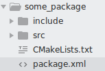
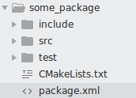
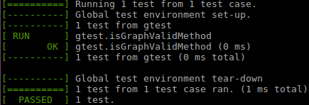

# ROS 패키지에서 gtest 사용법

gtest는 ros_comm 패키지에 포함되어있으므로 별다른 설치 없이 사용 가능하다. 아래는 기본적인 ROS 패키지 형태이다. <br/> <br/>


## 순서

1. 패키지에 test 폴더를 만들어준다. 이 곳에 테스트 코드를 작성한다.


2. 테스트 코드 작성 예
```cpp
#include <gtest/gtest.h>
#include "some.h" // 테스트 할 코드의 헤더 파일

TEST(SomeTest, booleanTest){
	SOMEClass someClass;
	ASSERT_EQ(false, someClass.someMethod(false));
}

// Run all the tests that were declared with TEST()
int main(int argc, char **argv){
  testing::InitGoogleTest(&argc, argv);
  ros::init(argc, argv, "tester");
  ros::NodeHandle nh;
  return RUN_ALL_TESTS();
}
```

3. 작성한 코드를 test 폴더에 저장

4. CMakeLists.txt 파일에 아래를 추가
```makefile
if (CATKIN_ENABLE_TESTING)
  catkin_add_gtest(utest test/utest.cpp)
  target_link_libraries(utest ${catkin_LIBRARIES})
endif()
```

5. 콘솔 창에서 아래처럼 입력하여 테스트
```
catkin_make tests
catkin_make run_tests
```
6. 아래와 같이 테스트 결과를 확인할 수 있음


---
### 참고
[gtest - ROS Wiki] (http://wiki.ros.org/gtest) </br>
[블로그 글] (http://ysonggit.github.io/coding/2014/12/19/use-gtest-in-ros-program.html) </br>
