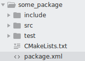

# ROS 패키지에서 unittest 사용법


아래는 기본적인 ROS 패키지 형태이다. <br/> <br/>


파이썬에서 unittest를 사용하기 위해서는 package.xml에 아래를 추가한다.
```xml
  <test_depend>rosunit</test_depend>
```

## 순서

1. 패키지에 test 폴더를 만들어준다. 이 곳에 테스트 코드를 작성한다.


2. 테스트 코드 작성 예
```python
#!/usr/bin/env python

PKG = 'tester'

import unittest

class SomeTest(unittest.TestCase):

    def test_add(self):
        self.assertFalse(1+1==2)

if __name__ == '__main__':
    import rosunit
    rosunit.unitrun(PKG, 'some_test', SomeTest)

```

3. 작성한 코드를 test 폴더에 저장

4. CMakeLists.txt 파일에 아래를 추가

```makefile
if (CATKIN_ENABLE_TESTING)
  catkin_add_nosetests(test/test_file_name.py)
endif()
```

5. 콘솔 창에서 아래처럼 입력하여 테스트
```
catkin_make tests
catkin_make run_tests
```

## 참고사항

#### 테스트 할 모듈을 불러왔는데 모듈이 없을 경우
1. 모듈이 있는 폴더가 패키지로 인식될 수 있게 \_\_init\_\_.py  파일을 추가한다.

2. 패키지 아래에 setup.py 파일을 추가하여 해당 모듈을 다른 파이썬 파일에서도 읽어올 수 있게 한다.<br/>
  - setup.py 파일의 위치는 pacakge.xml, CMakeLists.txt 파일과 같은 위치이다.

```python
#!/usr/bin/env python

from distutils.core import setup
from catkin_pkg.python_setup import generate_distutils_setup

# fetch values from package.xml
setup_args = generate_distutils_setup(
    packages=['package_name'],
    package_dir={'': 'src'},
)

setup(**setup_args)
```

3. catkin_make를 했을 경우 catkin workspace 아래 폴더가 있는지 확인한다.
  - devel/lib/python2.7/dist-packages/package_name 
    - catkin_make install 의 경우 install/lib/python2.7/dist-packages/package_name
 
4.모듈이 설치되었는데도 module 을 불러올 수 없을 경우 아래를 실행하여 $PYTHONPATH에 아래 경로를 추가한다.
  - devel/lib/python2.7/dist-packages 
```
source ~/catkin_ws/devel/setup.bash
```
  - Path 추가 사실을 확인하려면 파이썬 코드에서 sys.path를 출력해본다.
  
#### devel 폴더를 다 지워 경로가 꼬인 경우

- 아래를 실행한다.

```
source /opt/ros/kinetic/setup.bash
catkin_make
source ~/catkin_ws/devel/setup.bash
```
